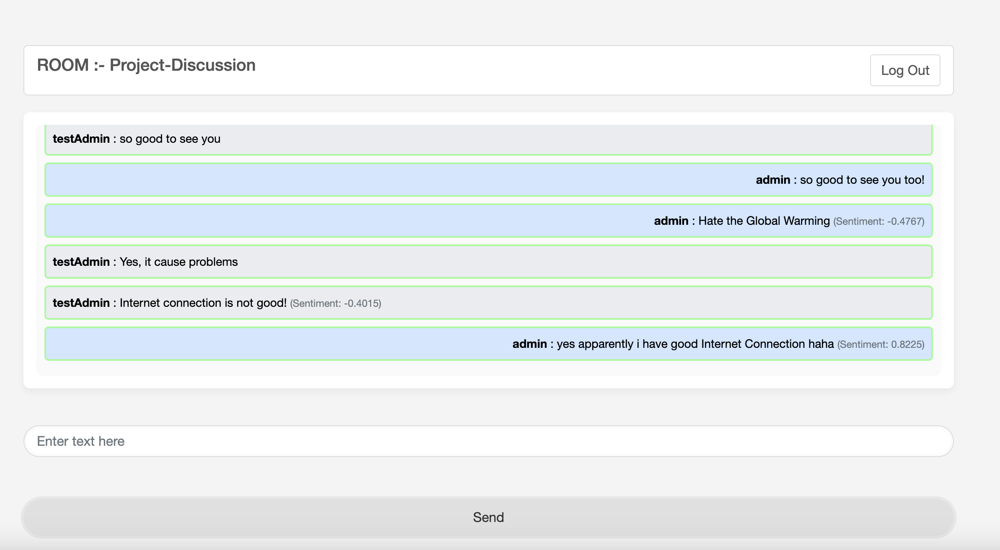
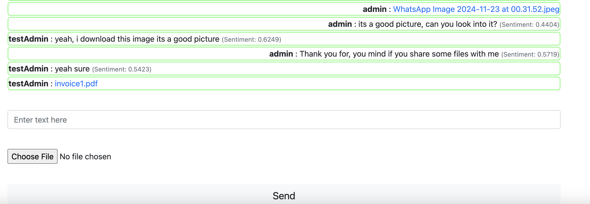

# Sentichat (Real-time Chat Application with Sentiment Analysis)

## Project Overview
This project is a **Real-Time Chat Application** built using **Django** and **WebSockets**, integrating **sentiment analysis** to enhance user interactions by providing emotional insights into conversations. Users can exchange messages, receive real-time sentiment feedback, and share files within the chat.

## Key Features
- **Real-time Messaging**: Users can send and receive messages instantly via WebSockets.
- **Sentiment Analysis**: Messages are analyzed using a NLP based pre-trained sentiment analysis model to provide emotional insights into the conversation.
- **File Sharing**: Users can send and download files directly within the chat interface.
- **Django Framework**: The project is built with the Django web framework for backend development, ensuring scalability and performance.
- **User Session**: Maintain user sessions so that messages are specific to the logged-in user and each chat room.

## How It Works
1. **WebSockets for Real-time Messaging**: 
   - The backend uses Django Channels to manage WebSocket connections.
   - When a user sends a message, it is broadcasted to all connected users in real time.

2. **Sentiment Analysis**:
   - Each message sent in the chat is passed through a sentiment analysis model.
   - The sentiment analysis is powered by nltk and a pre-trained model that classifies messages as positive, negative, or neutral.
   - When a user sends a message, it is passed through the NLP model, and the sentiment is displayed next to the message to enhance user experience.

4. **File Sharing**:
   - Users can upload and download files directly within the chat.
   - Files are stored in the server and linked to individual chat conversations.

## Snapshots

### Snapshot 1:

### Snapshot 2:

